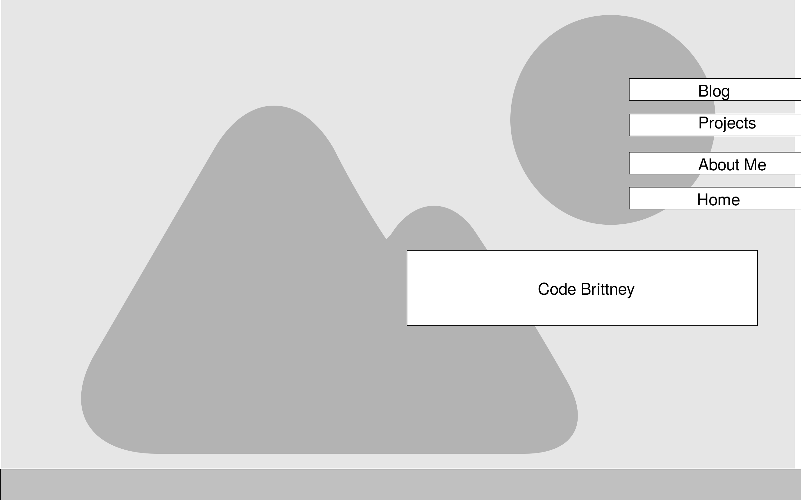
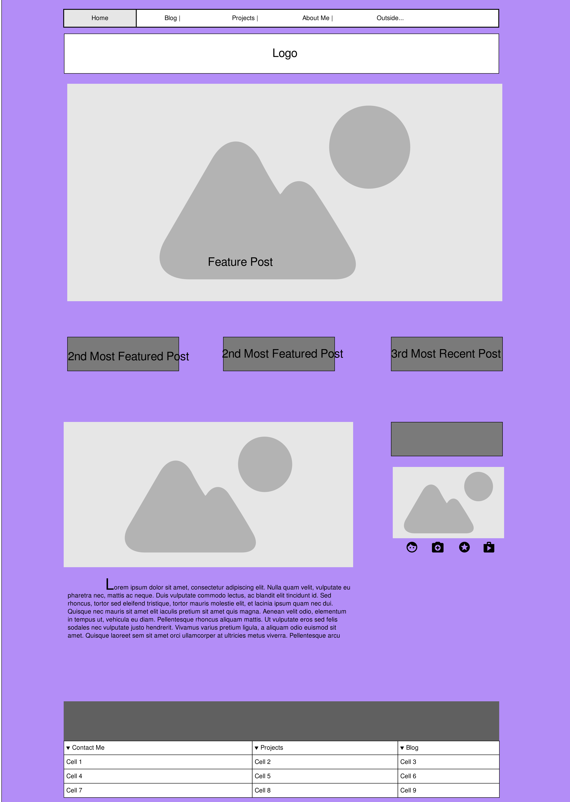

# Reflection 2.4 Wireframing

### My Index Wireframe

### My Blog's index Wireframe

## What is a wireframe?
A wireframe is a way of showing the rough, overall design and hierarchy of the web page's information. It can be as quick and rudimentary as a pizza box drawing, or using Illustrator to make something very polished and sophisticated. 

## What are the benefits of wireframing?
It's an important step in the design process (a large and crucial step within [The 6 phases of the Website Design](reflection.md)). Rather than spending lots of time and resources with coding up a website design, people use wireframes in very early stages of design. Its simplicity allows for designers to see where information goes, and how users will interact with the site. 

## Did you enjoy wireframing your site?
After lots of searching for inspiration, I went into making the wireframe with not a lot of confidence. I went through a lot of websites and used used [Wirify](http://www.wirify.com/) to turn the website into a wireframe. I found a few designs I liked, and worked on used it to help shape my wireframe.  In the end, I was surprisingly pleased at the results! :) 

## Did you revise your wireframe or stick with your first idea?
No, I'm going to stick with what I have for now. 

## What questions did you ask during this challenge? What resources did you find to help you answer them?

I questioned my taste a lot in what is possibly on trend or what looks outdated. Therefore, I stuck with a lot of websites that sold HTML templates as my inspiration since they surely are focusing on things that are good for websites in 2016. 
But then in the end, I thought screw it! I'll go with what I like and it will just make for an interesting journey :). 
We read a lot about wireframing in addition to overall UX design to websites, however I also had questions about content for different general sections of the website. For example, what do people typically put in their sidebars vs main content? 

## Which parts of the challenge did you enjoy and which parts did you find tedious?
I spent some time figuring out where I want to create my wireframe. I decided to stick with [Moqups](https://moqups.com/home/) which is a browser based wireframing app that I've used in the past. 
