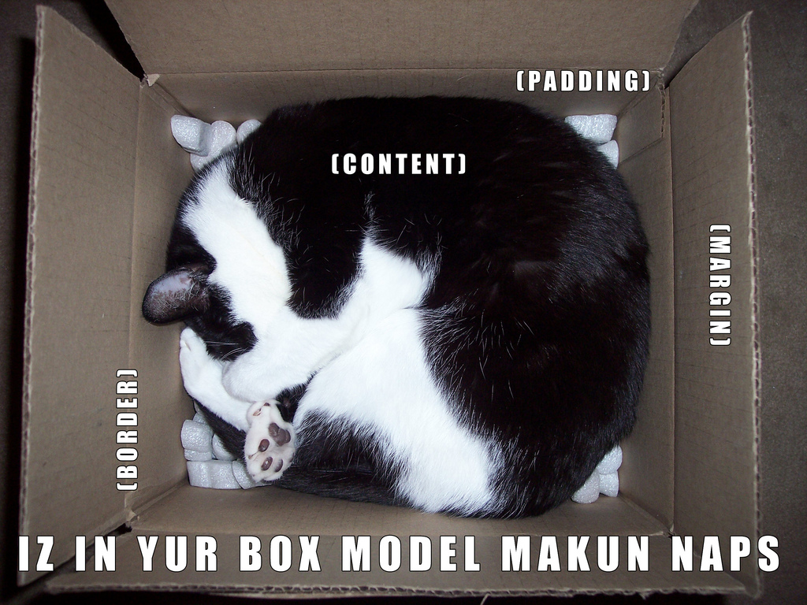
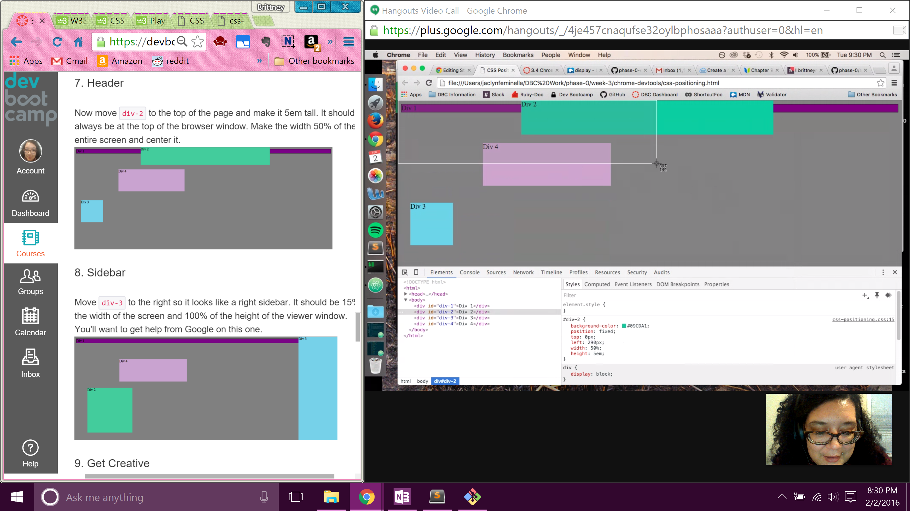

# Reflection 3.4 

## 1. How can you use Chrome's DevTools inspector to help you format or position elements?

It allows you to see live updates of the page as you edit, add, or remove CSS styling. 

## 2. How can you resize elements on the DOM using CSS?


With Dev Tools open y ou want to first locate the element you want to resize within the DOM. It looks just like an HTML file, but it's able to collapse and expand. Click on the link of the element you want to edit, and then it will load a section that says Styles. Now you want to look for a blank section that simply states

```
element.style{
       }
```
     
Here you can type in CSS as you normally would, and then press enter. Looking back into the actual webpage, you will see that element change instantly. If there's an error with what you inserted, you should see a little yellow caution symbol.  

## 3. What are the differences between absolute, fixed, static, and relative positioning? Which did you find easiest to use? Which was most difficult?

- Aboslute is when an element will be positioned basted on its parent element. This can only work if the parent element has a defined postion; if there is none the element will be absolutely positioned based on the `<body>`. 

- Fixed is positioned based on the browser window, it is independent of whatever else is happening on the page. Even when a page is scrolling around, the fixed element is always visible. 

- Static is the position elements have by default. It is when elements stack one after another in order of how they are written in HTML. 	

- Relative is when you tell an element to move somewhere. You can use CSS styling like `top` `right` `bottom` or `left` to move it to that location. Then with z-index you can bring it forward or backward to lay ontop of other elements. 

While working on this challenge as well as making the website in 3.3. I think it's something that you learn to grasp and understand the more webpages you make. 

I found a really helpful source about the differences, and it also gives a handy tool on the page to play around with 4 divs using the 4 positions.

[WebDevByDoing: "What’s the difference between Static, Relative, Absolute and Fixed Positioning?"](http://www.webdevbydoing.com/whats-the-difference-between-static-relative-absolute-and-fixed-positioning/)

## 4. What are the differences between margin, border, and padding?

### Best example for this 



Margin is to help with spacing your element away from others. Borders is to show where the actual boundaries are for your element. 
Padding is cushioning the info inside your element.

Another way to think of the three would be to think outside the box(margin), around the box (borders), and inside the box (padding).

## 5. What was your impression of this challenge overall? (love, hate, and why?)

Love. Chrome Dev Tools is a very exciting and power tool to use, and I'm happy we are getting to use this feature for our lessons. 

## My Chrome Dev Tools Challenge





