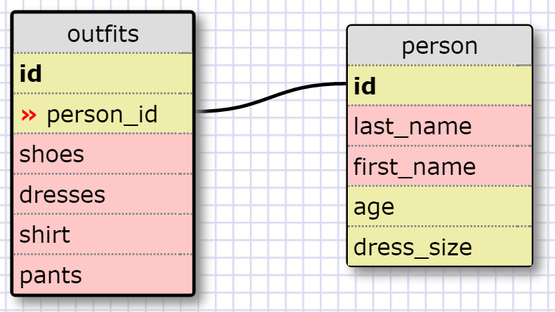

# Introduction to Database Schemas and SQL



## Select all data for all states.
`SELECT * FROM states;`

## Select all data for all regions.
`SELECT * FROM regions;`

## Select the `state_name` and population for all states.
`SELECT state_name, population FROM states;`

## Select the `state_name` and population for all states ordered by population. 
## The state with the highest population should be at the top.

`SELECT state_name, population FROM states ORDER BY population DESC;`

## Select the `state_name` for the states in region 7
`sqlite> SELECT state_name FROM states WHERE region_id = 7;`

## Select the `state_name` and `population_density` for states with a population 
## density over 50 ordered from least to most dense.
```
SELECT state_name, population_density FROM states 
WHERE population_density > 50 ORDER BY population_density ASC;
```

## Select the `state_name` for states with a population between 1 million and 
## 1.5 million people.
`SELECT state_name FROM states WHERE population BETWEEN 1000000 AND 1500000;`

## Select the `state_name` and `region_id` for states ordered by region in ascending order
`SELECT state_name, region_id FROM states ORDER BY region_id ASC;`

## Select the `region_name` for the regions with "Central" in the name.
`SELECT region_name FROM regions WHERE region_name LIKE '%Central%';`

## Select the `region_name` and the `state_name` for all states and regions in 
## ascending order by `region_id`. Refer to the region by name. (This will involve 
## joining the tables).
```
SELECT regions.region_name, states.state_name 
FROM states JOIN regions ON regions.id = states.region_id ORDER BY regions.id ASC;
```

# Reflection

1. What are databases for?

Databases are used for storing and retrieving data. It can be used for storing all kinds of different data. 

2. What is a one-to-many relationship?

It means that you have one type of data that has an unknown number of relationships with others
For example, you may have a database to store a person's info and the type of car they have. 
But what if someone has 2 cars, or 20 cars? Then  you form a one-to-many relationship because 
while one type of data is known, we don't know the quantity of the others. 

3. What is a primary key? What is a foreign key? How can you determine which is which?

A primary key is used to uniqely identify rows in a database. There is also a foreign key, which 
refers to a primary key of another entity. 

4. How can you select information out of a SQL database? What are some general guidelines for that?

The general structure of selecting information in SQL is to use `SELECT * FROM -name_of_table;`
Just like JavaScript, you want to end your statements with a semi-colon. 
